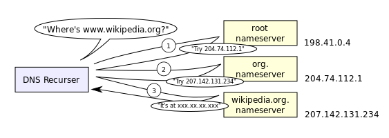

Title: How the Internet Works: Domain Names and Routing
Date: 2015-09-12 05:00
Author: Leta Montopoli
Slug: how-the-internet-works-2
Category: Blog
Tags: Web

This blog post is a continuation of my previous post [How the Internet Works](http://lmontopo.github.io/how-the-internet-works.html).  Here, I hope to answer the following questions: 

* **Since we don't usually specify the IP address of the computer we wish to connect with, how does our computer successfully connect with it?** 

* **Assuming the IP address of the destination computer is known, How does a request from my computer actually make it to the computer with this IP?  How does it know where that computer is?**

## The Domain Name System

A **domain name** is a human readable address of a computer on the internet.  Domain names are used all the time for activities requiring the internet, including sending emails and browsing web pages.  The part of a URL[^1] that appears after the protocol but before the file path is the domain name.  For example, `lmontopo.github.io` is the domain name in the URL of this blog post: `https://lmontopo.github.io/how-the-internet-works-2.html`.  

The term **Domain Name System (DNS)** refers to the internet service of translating domain names into IP addresses.  It consists of a distributed[^2] database of IP address and domain name pairs.  Hundreds of servers known as **DNS servers** are dedicated to working together to translate domain names into IP addresses.  There are two kinds of DNS servers: caching servers and authoritative name servers:  

* **Authoritative Servers** are responsible for maintaining a database of the IP addresses of domains within its 'authority'. *What does this mean?* Well, these servers are organized in a heiarchy that matches the structure of the domain names themselves.  Indeed, domain names consist of one or more domains separated by dots.  The rightmost domain is the *top-level domain*.  Examples of top-level domains include `com`, `org` and `edu`. Directly left of the top-level domain is the second-level domain, preceeded by more sub-domains until the leftmost word, the *host*.  An authoritative DNS server handles a specific level in this heiarchy and knows the IP addresses of all hosts and subdomains under it. So, for example, an authoritative DNS server with authority over the `github.io` domain would know the IP address of host `lmontopo.github.io`.

* **Caching Servers** are your computer's first point of contact with the DNS. Your computer is automatically[^3] configured with the IP address of a caching DNS server (usually provided by your Internet Service Provider) so that your computer knows who to contact for DNS resolution.  These caching servers communicate back and forth with authoritative name servers on your behalf until they find one that can resolve the supplied domain name into an IP address. 

**OK, I know this stuff can be confusing, but if you've made it this far, bear with me!**

*Let's go through an example to better understand how this works: Suppose we request the IP address of the domain name 'www.wikipedia.org'*:

As previously explained, our computer will first send a request to the DNS Server (a cache server) specified in its network configuration settings.  Lets call this cache server Jane, since we'll be talking about it lots.  Our computer will ask Jane something like “Can you tell me the IP address of www.wikipedia.org?”. Usually the DNS server provided by our ISP will have a cache[^4] of frequently resolved domain names.  Assuming Jane has one, she'll search her cache for this domain name.  If Jane finds it she'll get back to us straight away with the desired IP address. Otherwise Jane will strip the host from the domain name and search her cache for a server with authority over the remaining name: `wikipedia.com`. If Jane find this server's IP in her cache she'll send our original request-“Can you tell me the IP address of www.wikipedia.org?”- to this server.  For now, lets assume Jane's cache doesn't contain 'wikipedia.com'.  Then Jane will again search her cache for the server with authority over the `com` domain.  (Notice that each time the authoritative DNS server strips of the leftmost word off the domain name.)  Finally, if Jane doesn't find this server's IP, she'll resort to contacting the **DNS Root Servers**.  Root servers are the Authoritative DNS Servers which reside at the top of the heiarchy, right above above top level DNS servers.  *(Cache servers, like Jane, are pre-configured with a list of root servers so that they always have someone to contact.)* In this case the root server would respond with a list of server IPs of the `com` domain.  Jane would then contact one of the servers from this list, and ask it to resolve `www.wikipedia.com`.  The `com` DNS server would give Jane some IPs of DNS servers with authority over the `wikipedia.com` domain.  Jane could then contact one of these servers, any of which could resolve `www.wikipedia.com`.  When Jane finally gets the translation she sends us back our desired IP address.  Jane will also keep (at least temporarily) a cache of the IP addresses that were just discovered: IPs of `com` domain servers, `wikipedia.com` domain servers and the IP address of `www.wikipedia.com`.  The following picture demontstrates this process:[^5]

*Cool Trick: you can actually bypass the whole Domain Name Resolution Process by typing in the IP address of the computer you wish to communicate with.*

## Routing

Once we know the IP address of the computer we want to talk to, how does our request make its way to that computer?  

The answer, is **routers**.  Routers connect

Routers are connected between networks to control the flow of messages between them. The main responsibilitis of a router are to ensure messages get sent where they are intended, and to ensure messages don't get sent into networks where they weren't intended.  But how does it do this?  

Well, each router usually knows about the IP addresses within its sub-networks but not about the IP addresses in networks above it (similar to the DNS system!).  At a high level, we can imagine that a request arrives at its destination IP address by first travelling up this hierarchy of routers until a router that knows about the destination's IP address is reached. At this point the request would begin to travel back down the chain in the direction of the desired computer. 

**Although this gives us a nice idea of how routing works, in reality there's a bit more to it.** The picture I painted seems to imply that the computer at the ‘top’ of this chain is all knowing -i.e. it knows all the IP addresses of every computer below it- and that is not the case. Each router has a configuration table which lists patterns of IP addresses, and rules to follow based on those patterns. The router will scan the destination address and match that IP address against the patterns in its table. When the router finds the category that the IP fits into, it follows the related instructions to go in a specific direction. Before actually sending out information in this direction, the router will check to see if that direction is satisfactory (i.e. flow is OK there, and nothing seems broken). If all is well it will go ahead. Otherwise it will check the configuration table for an alternate route. Because many different routes exist between two computers on the internet, a request made to google.com one minute might take a completely different route than the next minute. And that's part of the beauty of routing, is that its adaptable and can act accordingly.

In order for routers to do their job, they are also performing **Network Address Translations** (NAT).  Remember last time how I mentioned that your personal computer's public IP is your router's IP?  Well, your router has to translate all of the traffic coming from your local network, re-addressing it with its own IP address.  Then the router has to keep track of which incoming messages (all of which are addressed to *its* IP address!) are meant for which computer in its local Network.  Even more complicated, routers may have to deal with situations where a private IP in your local network overlaps with a public IP address somewhere in the internet.  In some cases this might cause issues, but other times your router may successfully create a 'lookup table' to keep track of which computer is which, and translate IP addresses to compensate.

### Thanks Again

Well, thats it (for now!) on how the internet works.  I hope that if you've made it this far you've enjoyed the journey.  As always, feel free to reach out to me if you have any questions!  I am no expert, but if there's something I can help you understand I'd be happy to do so!

[^1]: URL stands for Uniform Resource Locator and refers to the web address used to locate a web page on the World Wide Web.

[^2]: The word *distributed* in this context just means that the database is stored over many computers, as opposed to a single database on a single computer.  

[^3]: Of course, you can override this setting if you'd like to use some other Domain Name System Server.

[^4]: A **cache** is just a fancy word for data that is stored on a machine.  Usually this data is the result of a computation or process that it previously performed, so that if it needs the result again it can provide it more quickly. 

[^5]: I got this great image from the wikipedia page on the Domain Name System.  You can find it [here](https://en.wikipedia.org/wiki/Domain_Name_System#/media/File:An_example_of_theoretical_DNS_recursion.svg).