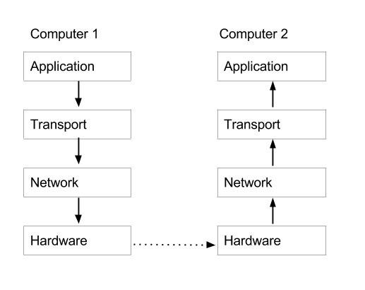

Title: How the Internet Works
Date: 2011-09-10 05:00
Author: Leta Montopoli
Slug: how-the-internet-works
Category: Blog
Tags: Web

## What is the internet? 

One thing I’d like to clarify right off the bat is that when we connect to the internet we are connecting to other physical computers.  Any service accessed through the internet- email, Skype, reading the news online- is the result of obtaining data from one or more physical computers.  The internet isn’t some magical entity where resources appear out of thin air.  Indeed, files saved on an online storage system are physically stored on one or more physical computer somewhere in the world. Those of you who already knew this might find it silly of me to point this out, but I’m sure that there are people out there who have this misconception - I used to be one of them.

In order to understand the structure of the internet, we'll begin by talking about computer networks in general.

### Types of Networks

Different types of computer networks can be classified by size. Lets start with the smallest and work our way up to the largest - the internet:  

* The smallest type of network is a **Personal Area Network** (PAN).  A good example of this type of network is the use of bluetooth. In a personal area network computers are interacting with each other over a very short distance. 
* The second smallest type of network is a **Local Area Network**, or LAN.  These networks span the area of a house, or a few floors of an office building.  As an example: consider how the computers in an office building are often all connected to the same printer.   Another example would be you pinging [^1] your co-workers computer when you’re both in the office.  This would work through your router. 
* At a larger scale we have **Metropolitan Area Network** (MAN) which can span a few blocks, or the entire city.  As an example, we can think of all the personal home routers that people have in Toronto.  In theory, they are all connected to one (or maybe two) Network Access Points within the city.  
* Anything larger than a MAN is considered to be a **Wide Area Network**, or WAN. The largest WAN is the internet, connecting computers all over the earth.  

The internet can be thought of as a compilation of some of these smaller networks.  When I connect to the internet at home (in Toronto), I’m connected to my apartments LAN through my router.  This router is connected to a MAN which is connected to a main internet exchange point in Toronto, where it’s connected to other exchange points within Canada and then the globe.  The following image [^2] serves as a good visual depiction. 

### Physically how are computers connected?

Sometimes transmission happens wirelessly, other times it happens through physical wires. 
Bluetooth and wifi are examples of a wireless network connections.  In these situations radio signals are used to carry data from one computer to the next.  Most of these wireless networks happen over very short distances.  Between cities and countries and continents, computers are usually connected through wires.  Yes, *wires are literally in the ocean, connecting continents so that we can chat to people across the globe.*

Cool. Now we have an idea of what the internet *is*.  It is a network of computer networks connecting computers accross the globe.  These connections can be wireless or through wires.  But *how* does it work?

## How is data transmitted?
How do computers understand each other?  How does a message get to the appropriate computer? Introducing... the protocol stack!

### The Protocol Stack 

A **protocol** is just a set of rules that computers obey when they exchange data.  Every type of communication that occurs over the internet uses a set of protocols specified by its corresponding protocol stack.  Different applications (skype, email, etc) may use different protocol stacks.  Here is a diagram depicting the primary layers in the stack: 

As you can see from the diagram, when data gets sent from Computer 1 to Computer 2, Computer 1 first has to prepare the data for its transmission by going through each of the layers of the protocol stack to add information, package it up, possibly encode or translate it.  When the data is ready, it is passed through the internet from Computer 1 to Computer 2, where the data is unpacked and transformed into its original form.  Lets start from the bottom and work our way up, describing briefly each of these layers.  

####Hardware Layer: 
This layer is responsible for translating messages from your computer's native language (in 0s and 1s) to signals that can be transmitted either through wire or radio signals.  Most laptops today have hardware specific for both the ethernet cable and for wifi.  Note that different hardware is required in your computer for each kind of physical connection.  Often the protocol associated with this hardware requires that the unique address on the associated hardware be specified when going from one computer to the next.  This address is called the Media Access Control Address, or MAC address.  You can find the MAC addresses of the hardware on your computer by going into the network settings. 

####Internet Protocol Layer:
Every computer on the internet is marked with a ‘unique’ address called an Internet Protocol address, or IP address.  In order for data to move from one computer to the next, it must be labeled with the target IP address and the sender’s IP address.  IP addresses can be split into two categories, public and private.   Public IPs are given to every computer ‘visible’ on the Internet and they are guaranteed to be unique. Private IPs  are given to computers within the same Local Area Network and need only be unique with respect to the other IPs on that network.  When you connect to your wifi at home, you’re acting as your gateway to the internet and your private IP allows your router to distinguish your computer from others on the network.  IP addresses can also be static or dynamic.  Static IPs don’t change, while dynamic ones do.  Often the private IPs within a local network are dynamically assigned so that IP addresses can be reused.  

####Transportation Protocol Layer: 
Among other things, the transportation protocol is in charge of labelling which port number on a receiving computer a message is sent to.  You can think of the port as being analogous to specifying a person’s name on a letter to distinguish which person in a house the letter is being sent to.  Similarly, since your computer has multiple applications using the internet, the port number specifies which applications data is meant for.  Other responsibilities of the transport layer may include segmentation and desegmentation of the data, ensuring sent data is received, and ensuring it is received in the desired order.

####Application Level Protocol:
Specific to the application, be it email, skype, or the world wide web. In the following example we will discuss the Hyper Text Transfer Protocol (HTTP), which is a popular Application Level Protocol.

**Classic Example: Suppose I’m connecting to the internet through my apartment’s wifi and I type www.wikipedia.com into my browser and press enter.**

*Here the application in use is the world wide web.  The request will be formatted according to the application level protocols specifications (in this case HTTP): `HTTP 1.1/ GET wiki/main_page`.  This tells the application on the receiving end that we are using HTTP protocol and that we wish to GET (meaning retrieve) the resource specified.  This message will get passed from our browser (the application) to the computer’s operating system where the transportation protocol will do its work.  In this example TCP, Transmission Control Protocol will be used.  When necessary, TCP will split the message into smaller (more manageable) chunks called packets before sending. In this case, each packet will also be labeled so that the receiver knows in which order the packets should be read.  TCP will also attach the port number (in this case 80) to each packet.  Next, the Internet Protocol further packages each packet with the sender and receiver's IP addresses, before handing over control to the hardware/link layer.  This layer wraps the packages with the wifi MAC address on your computer and translates messages into radio signals to be sent to the router.  This message will go from computer to computer, continually unpacked and repackaged by the hardware layers as it travels, until it reaches its destination, where the wiki/main_page resource lives.  The destination computer will translate the message into its native language through the hardware layer.  Then the TCP layer will ensure that each package has arrived (remember that they are labelled) and if one is missing, the computer will send out a request for the missing packet.  If all have arrived, it will place them in order, and send them to the appropriate computer application.  This main wiki page will then be retrieved from the application, and the process of packaging it up for sending will commence.  The resource will be wrapped with the message `HTTP 1.1 200 OK` before being split up into manageable chunks, labeled, then repackaged with the IP address of the destination and sender, and further translated and prepared by the hardware layer before being sent out.  When the message finds its way back to our computer, it will be unpacked by each layer until the contents of the message, the wiki/main_page, is provided to our browser to display.* 

### Domain Names and Routing

At this point we’ve answered a lot of questions in regards to how the internet works.  But, there’s still a big missing piece of the puzzle, namely, how does my computer know the IP address of the computer we want a resource from, and how does my router know how to navigate to that computer? 

Since you don’t always know the IP address of the computer whose resource you want, we resort to Domain Names.  A Domain Name is the first part of the URL [^3], for example, wikipedia.com.  Before requests are send from your router to the internet, the Domain Name must be translated into an IP address.  This is done through the ‘Domain Name Lookup’.  Your router will know about a *Domain Name System* (DNS) server provided by your internet service provider, and the router will send out a request to that server saying “hey, I wanna contact wikipedia.com, what's the IP address?”  Of course, each domain name server doesn’t have a complete list of the the domain names and their respective IP addresses, but they have part of a list, and they can work their way through the DNS, moving from computer to computer, until they find a server that knows the IP they are looking for.

*Cool Trick: you can actually bypass the whole Domain Name Resolution Process by typing in the IP address of the computer you wish to communicate to.  But, obviously, it’d be hard to remember the IPs for all the computers you communicate with.*

**Once we know the IP address of the computer we want to talk to, how does our router know how to get there?**  

Routers are connected between networks. Each router usually knows about the IP addresses within its sub-networks but not about the IP addresses in networks above it.  At a high level, we can imagine that a request arrives at its destination IP address by first travelling up this hierarchy of routers until a router that knows about the destination's IP address is reached.  At this point the request would begin to travel back down the chain in the direction of the desired computer.   Although this gives us a nice idea of how routing works, in reality there's a bit more to it.  The picture I painted seems to imply that the computer at the ‘top’ of this chain is all knowing -i.e. it knows all the IP addresses of every computer below it- and that is not the case.  Each router has a configuration table which lists patterns of IP addresses, and rules to follow based on those patterns.  The router will scan the destination address and match that IP address against the patterns in its table.  When the router finds the category that the IP fits into, it follows the related instructions to go in a specific direction.  Before actually sending out information in this direction, the router will check to see if that direction is satisfactory (i.e. flow is OK there, and nothing seems broken).  If all is well it will go ahead. Otherwise it will check the configuration table for an alternate route.  Because many different routes exist between two computers on the internet, a request made to google.com one minute might take a completely different route than the next minute.  And that's part of the beauty of routing, is that its adaptable and can act accordingly. 

#### Thanks

Thanks for reading along on this journey to better understand the internet.  There is, of course, still lots of details that I have left out of this discussion, and much that I still have to learn, but I think I've provided enough details to staisfy some itching curiousities.  

Big thanks to [Jasmin Lantos](http://individual.utoronto.ca/jnlantos/) for studying this topic with me during our 10% time at [Security Compass](https://securitycompass.com/)! 

[^1]: For anyone unfamiliar with the PING command, try it out!  Simply type `ping ip_address` to effectively 'ping' the computer with the corresponding IP address.  You can also ping a server by their hostname. 

[^2]: This image is adapted from [http://www.gta.ufrj.br/ensino/eel879/trabalhos_vf_2008_2/igorcamp/LAN_MAN_WAN.JPG](http://www.gta.ufrj.br/ensino/eel879/trabalhos_vf_2008_2/igorcamp/LAN_MAN_WAN.JPG)

[^3]: URL stands for **Uniform Resource Locator** and refers to the web address used to locate a web page on the World Wide Web. 